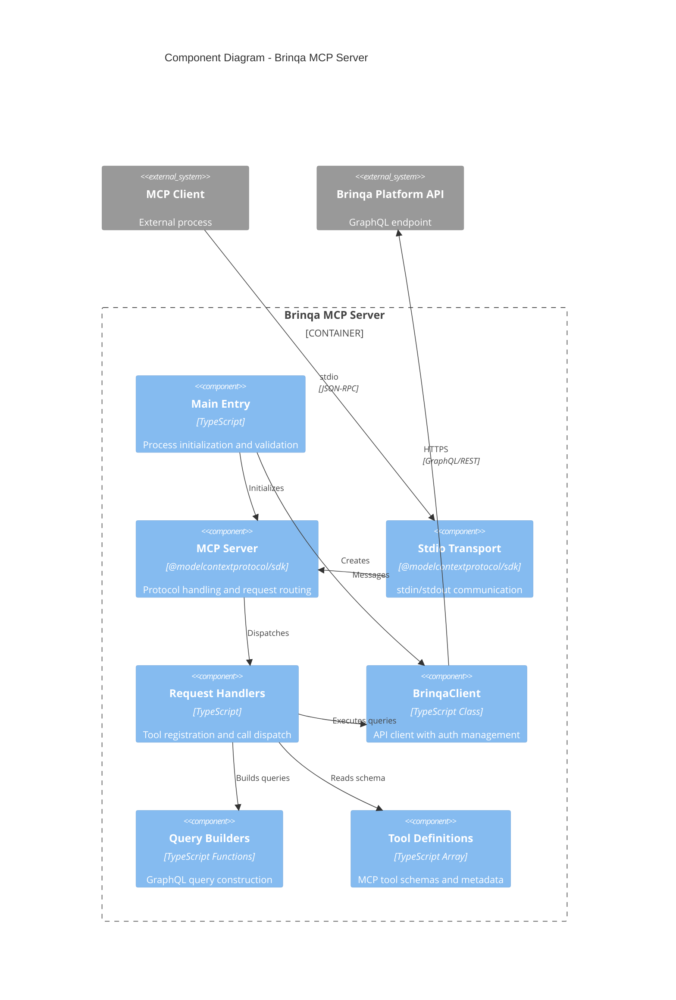
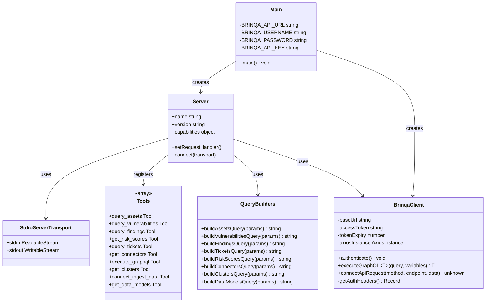
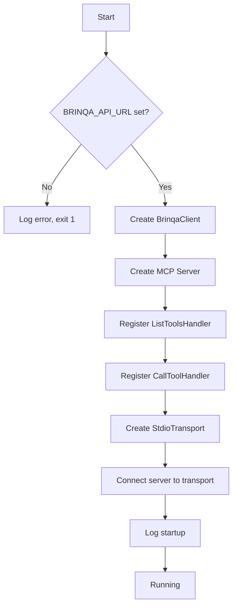
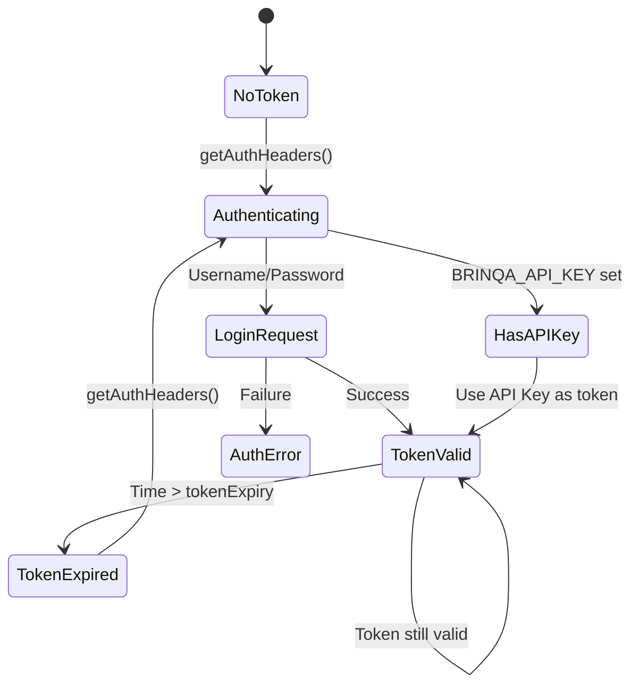
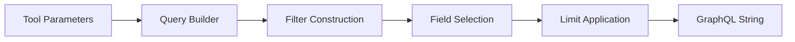
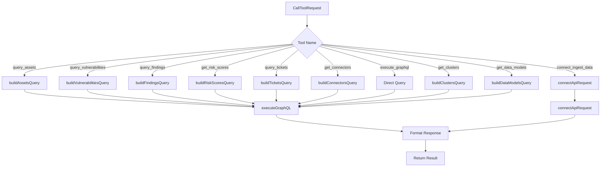

# Component Architecture (C4 Level 3)

This document describes the internal component structure of the Brinqa MCP Server, detailing the code organization, responsibilities, and interactions.

## Component Diagram



## Detailed Component View



## Component Responsibilities

### 1. Main Entry (`main()`)

**File**: `src/index.ts` (lines 916-1115)

| Responsibility | Implementation |
|----------------|----------------|
| Environment validation | Checks BRINQA_API_URL is set |
| Client instantiation | Creates BrinqaClient with base URL |
| Server creation | Initializes MCP Server with metadata |
| Handler registration | Sets up ListTools and CallTool handlers |
| Transport connection | Connects to stdio transport |
| Error handling | Catches and logs fatal errors |

**Code Flow**:


### 2. BrinqaClient Class

**File**: `src/index.ts` (lines 33-176)

| Method | Purpose |
|--------|---------|
| `constructor(baseUrl)` | Initialize axios instance with base configuration |
| `authenticate()` | Obtain/refresh bearer token via login or use API key |
| `getAuthHeaders()` | Build authorization headers, ensuring valid token |
| `executeGraphQL<T>(query, variables)` | Execute GraphQL query with automatic auth retry |
| `connectApiRequest(method, endpoint, data)` | Execute Brinqa Connect REST API request |

**Authentication State Machine**:


### 3. Tool Definitions

**File**: `src/index.ts` (lines 179-472)

The `tools` array defines 10 MCP tools with JSON Schema input definitions:

| Tool Name | Category | Description |
|-----------|----------|-------------|
| `query_assets` | Read | Query hosts, applications, containers, cloud resources |
| `query_vulnerabilities` | Read | Query CVEs and vulnerability details |
| `query_findings` | Read | Query specific vulnerability instances on assets |
| `get_risk_scores` | Read | Get organization or asset-level risk analytics |
| `query_tickets` | Read | Query remediation tickets and SLA status |
| `get_connectors` | Read | View data connector status and sync history |
| `execute_graphql` | Read | Execute custom GraphQL queries |
| `get_clusters` | Read | Query automated data groupings |
| `connect_ingest_data` | Write | Ingest custom data via Brinqa Connect |
| `get_data_models` | Read | Explore knowledge graph schema |

### 4. Query Builders

**File**: `src/index.ts` (lines 475-913)

Pure functions that construct GraphQL query strings based on input parameters:

| Builder | Outputs | Features |
|---------|---------|----------|
| `buildAssetsQuery` | Asset query | Custom field selection, type/status filters |
| `buildVulnerabilitiesQuery` | Vulnerability query | Severity, status, CVE ID filters, affected assets |
| `buildFindingsQuery` | Findings query | Risk score range, age filtering |
| `buildTicketsQuery` | Tickets query | Priority, assignee, SLA status filters |
| `buildRiskScoresQuery` | Risk query | Scope-based, factor breakdown, trends |
| `buildConnectorsQuery` | Connectors query | Type, status filters, sync history |
| `buildClustersQuery` | Clusters query | Cluster type filtering |
| `buildDataModelsQuery` | Data models query | Attribute and relationship inclusion |

**Query Builder Pattern**:


### 5. Request Handlers

**File**: `src/index.ts` (lines 942-1103)

Two registered handlers for MCP protocol:

#### ListToolsHandler
```typescript
server.setRequestHandler(ListToolsRequestSchema, async () => {
    return { tools };
});
```
Returns the complete tool definitions array.

#### CallToolHandler
Switch-based dispatcher that:
1. Extracts tool name and arguments
2. Routes to appropriate query builder
3. Executes via BrinqaClient
4. Returns JSON result or error



## Type Definitions

### Interfaces

```typescript
interface AuthResponse {
    access_token: string;
    token_type: string;
    expires_in: number;
}

interface GraphQLResponse<T> {
    data?: T;
    errors?: Array<{
        message: string;
        locations?: Array<{ line: number; column: number }>;
        path?: string[];
    }>;
}
```

### Tool Input Schema Pattern

Each tool follows this JSON Schema structure:
```typescript
{
    type: "object",
    properties: {
        // Tool-specific parameters
    },
    required: [] // Most fields optional for flexibility
}
```

## Code Organization

```
src/
└── index.ts          # Single-file implementation (1116 lines)
    ├── Lines 1-31    # Imports and environment variables
    ├── Lines 33-176  # BrinqaClient class
    ├── Lines 179-472 # Tool definitions array
    ├── Lines 475-913 # Query builder functions
    └── Lines 916-1115# Main function and handlers
```

### Cohesion Analysis

| Component | Cohesion Type | Assessment |
|-----------|---------------|------------|
| BrinqaClient | Functional | High - single responsibility (API communication) |
| Query Builders | Functional | High - pure functions, single purpose each |
| Tool Definitions | Informational | Medium - data cohesion, grouped by purpose |
| Main/Handlers | Temporal | Medium - initialization order matters |

### Coupling Analysis

| Relationship | Coupling Type | Assessment |
|--------------|---------------|------------|
| Handlers -> QueryBuilders | Data | Low - parameters passed, strings returned |
| Handlers -> BrinqaClient | Stamp | Low - client instance shared |
| Main -> All Components | Control | Medium - orchestrates initialization |
| Tools -> Handlers | Content | Medium - schema drives handler logic |

## Open Questions and Gaps

1. **Single File**: All code in one file (1116 lines) - could benefit from module extraction
2. **No Interface Segregation**: Tools array mixes different tool categories
3. **No Error Types**: Generic Error used throughout, no typed error hierarchy
4. **No Unit Tests**: Components not designed with testability in mind
5. **No Dependency Injection**: BrinqaClient hardcoded in main, difficult to mock

---

[Back to Index](./README.md) | [Previous: Containers](./containers.md) | [Next: Deployment](./deployment.md)
