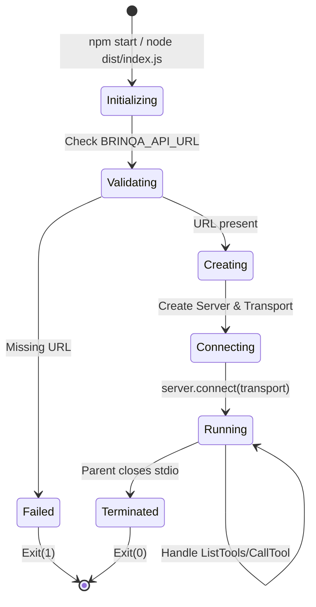
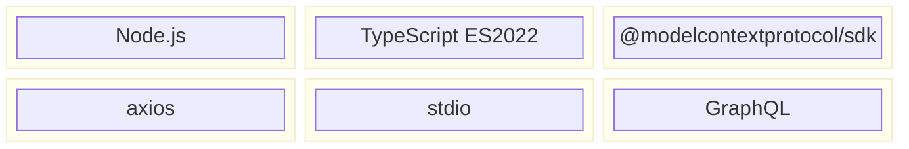

# Container Architecture (C4 Level 2)

This document describes the container-level architecture of the Brinqa MCP Server, detailing the runtime components and their interactions.

## Container Diagram

```mermaid
C4Container
    title Container Diagram - Brinqa MCP Server

    Person(user, "Security Analyst", "Queries risk and vulnerability data")

    System_Boundary(localEnv, "Local Environment") {
        Container(mcpClient, "MCP Client Process", "Node.js / Python", "AI assistant runtime (Claude CLI, VS Code extension)")
        Container(mcpServer, "Brinqa MCP Server", "Node.js", "TypeScript MCP server providing Brinqa tools")
    }

    System_Ext(brinqaCloud, "Brinqa Cloud Platform") {
        ContainerDb(brinqaGraph, "Knowledge Graph", "Graph Database", "Assets, vulnerabilities, relationships")
        Container(brinqaAPI, "Brinqa Platform API", "GraphQL", "CAASM API endpoint")
        Container(brinqaConnect, "Brinqa Connect API", "REST", "Data ingestion endpoint")
        Container(brinqaAuth, "Auth Service", "OAuth2", "Token issuance and validation")
    }

    Rel(user, mcpClient, "Natural language queries")
    Rel(mcpClient, mcpServer, "MCP Protocol", "stdio/JSON-RPC")
    Rel(mcpServer, brinqaAuth, "Authenticate", "HTTPS POST /api/auth/login")
    Rel(mcpServer, brinqaAPI, "Query data", "HTTPS POST /graphql/caasm")
    Rel(mcpServer, brinqaConnect, "Ingest data", "HTTPS POST /connect/ingest")
    Rel(brinqaAPI, brinqaGraph, "Reads")
    Rel(brinqaConnect, brinqaGraph, "Writes")
```

## Container Descriptions

### MCP Client Process

| Attribute | Value |
|-----------|-------|
| **Type** | Runtime Host |
| **Technology** | Node.js, Python, or native (varies by client) |
| **Responsibility** | Hosts MCP server, routes tool calls, renders responses |
| **Examples** | Claude CLI, Claude Desktop, VS Code with MCP extension |

The MCP Client is responsible for:
- Spawning the MCP server as a child process
- Managing the stdio communication channel
- Providing environment variables (credentials)
- Presenting tool results to the user

### Brinqa MCP Server

| Attribute | Value |
|-----------|-------|
| **Type** | MCP Server |
| **Technology** | Node.js (ES2022), TypeScript |
| **Port/Protocol** | stdio (stdin/stdout) |
| **Responsibility** | Translate MCP tool calls to Brinqa API requests |

**Key Characteristics**:
- Single process, single thread (Node.js event loop)
- Stateless between tool calls (except auth token cache)
- No persistent storage
- No network listener (stdio only)

### Brinqa Platform API (/graphql/caasm)

| Attribute | Value |
|-----------|-------|
| **Type** | API Gateway |
| **Technology** | GraphQL over HTTPS |
| **Endpoint** | `https://<instance>.brinqa.net/graphql/caasm` |
| **Authentication** | Bearer Token |

The primary read interface to the Brinqa knowledge graph supporting:
- Complex queries with filtering
- Relationship traversal
- Pagination
- Field selection

### Brinqa Connect API (/connect/ingest)

| Attribute | Value |
|-----------|-------|
| **Type** | Ingestion API |
| **Technology** | REST over HTTPS |
| **Endpoint** | `https://<instance>.brinqa.net/connect/ingest` |
| **Authentication** | API Key (X-API-KEY header) |

Write interface for custom data ingestion:
- Namespace-qualified data records
- Schema-flexible JSON payloads
- Asynchronous processing

### Brinqa Auth Service

| Attribute | Value |
|-----------|-------|
| **Type** | Authentication Service |
| **Technology** | OAuth2-like token service |
| **Endpoint** | `https://<instance>.brinqa.net/api/auth/login` |
| **Token Validity** | 24 hours (86400 seconds) |

Supports two authentication modes:
1. **Username/Password**: Returns JWT bearer token
2. **API Key**: Pre-authenticated key for Connect API

## Runtime View

```mermaid
flowchart TB
    subgraph "MCP Client Process"
        MCPRuntime[MCP Runtime]
        StdioChannel[stdio Channel]
    end

    subgraph "Brinqa MCP Server Process"
        Transport[StdioServerTransport]
        Server[MCP Server]
        Handlers[Request Handlers]
        Client[BrinqaClient]
        QueryBuilders[GraphQL Query Builders]
    end

    subgraph "Network"
        Axios[Axios HTTP Client]
    end

    subgraph "Brinqa Cloud"
        AuthAPI[/api/auth/login]
        GraphQLAPI[/graphql/caasm]
        ConnectAPI[/connect/ingest]
    end

    MCPRuntime --> StdioChannel
    StdioChannel <--> Transport
    Transport <--> Server
    Server --> Handlers
    Handlers --> Client
    Handlers --> QueryBuilders
    Client --> Axios
    Axios --> AuthAPI
    Axios --> GraphQLAPI
    Axios --> ConnectAPI
```

## Process Model



## Inter-Container Communication

### MCP Protocol (stdio)

| Direction | Format | Example |
|-----------|--------|---------|
| Client -> Server | JSON-RPC Request | `{"jsonrpc":"2.0","method":"tools/list","id":1}` |
| Server -> Client | JSON-RPC Response | `{"jsonrpc":"2.0","result":{"tools":[...]},"id":1}` |

### Brinqa API (HTTPS)

| Operation | Method | Endpoint | Content-Type |
|-----------|--------|----------|--------------|
| Authenticate | POST | /api/auth/login | application/json |
| GraphQL Query | POST | /graphql/caasm | application/json |
| Data Ingest | POST | /connect/ingest | application/json |

## Technology Stack



### Dependencies

| Package | Version | Purpose |
|---------|---------|---------|
| `@modelcontextprotocol/sdk` | ^1.0.0 | MCP server framework |
| `axios` | ^1.6.0 | HTTP client for API calls |
| `typescript` | ^5.3.0 | Build-time type checking |
| `@types/node` | ^20.10.0 | Node.js type definitions |

## Scaling Considerations

| Aspect | Current State | Limitation |
|--------|---------------|------------|
| Horizontal Scaling | Single instance | MCP client spawns one server process |
| Vertical Scaling | Node.js single thread | CPU-bound by event loop |
| Concurrent Requests | Sequential tool calls | MCP protocol is request-response |
| Connection Pooling | Single axios instance | HTTP/2 multiplexing via axios |

The MCP architecture inherently limits scaling to a single server instance per client. For multi-user scenarios, each user's MCP client spawns its own server process.

## Open Questions and Gaps

1. **Resource Limits**: No memory or CPU limits configured
2. **Health Checks**: No liveness/readiness probes (not applicable for stdio)
3. **Graceful Shutdown**: No signal handlers for SIGTERM/SIGINT
4. **Connection Reuse**: Axios connection pooling not explicitly configured
5. **Timeout Configuration**: No client-side request timeouts configured

---

[Back to Index](./README.md) | [Previous: Context](./context.md) | [Next: Components](./components.md)
