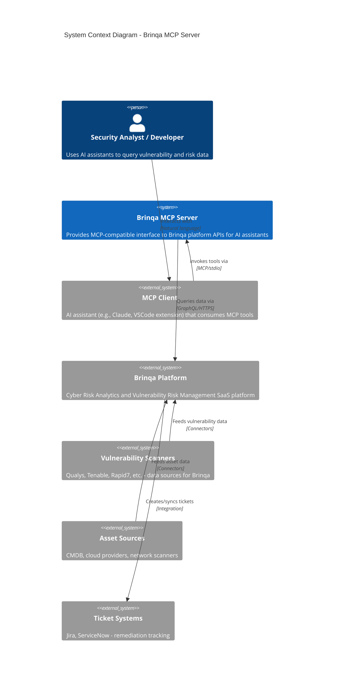
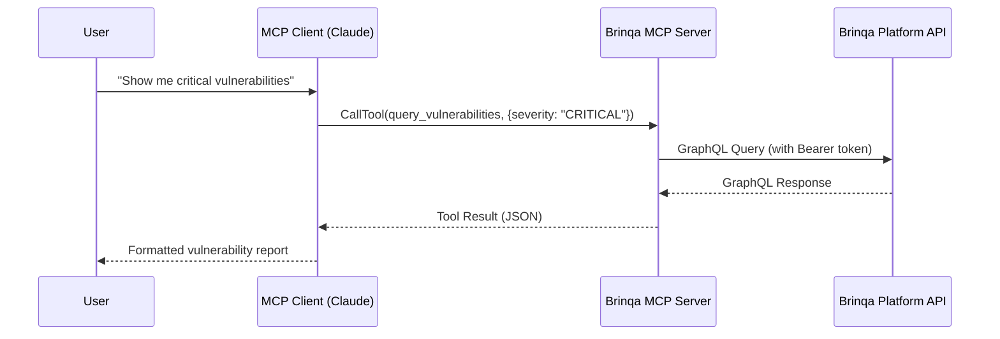
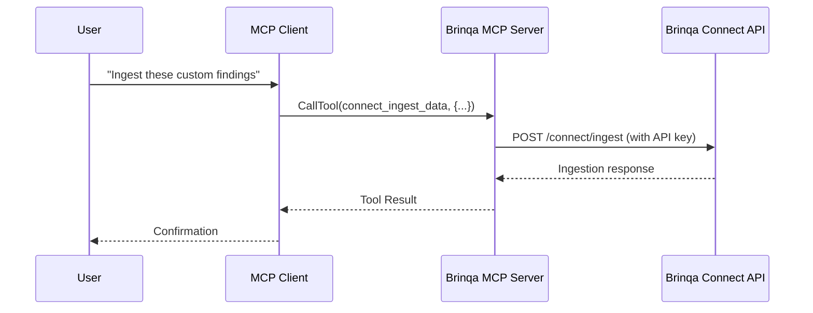

# System Context (C4 Level 1)

This document describes the system context for the Brinqa MCP Server, showing how it fits within the broader ecosystem of systems and users.

## System Context Diagram

## Narrative Description

### Purpose

The Brinqa MCP Server acts as a **bridge** between AI assistants implementing the Model Context Protocol (MCP) and the Brinqa vulnerability risk management platform. It translates natural-language-driven tool invocations into structured GraphQL queries against the Brinqa API.

### Primary Actors

| Actor | Type | Description |
|-------|------|-------------|
| Security Analyst | Human User | Queries vulnerability data, risk scores, and remediation status via AI assistant |
| Developer | Human User | Explores data models, executes custom GraphQL queries for integration development |
| MCP Client | System | AI assistant (Claude, Copilot, etc.) that hosts and invokes MCP tools |

### External Systems

#### Brinqa Platform

- **Role**: Primary data source and destination
- **Integration Type**: GraphQL API over HTTPS
- **Data Exchanged**:
  - Assets (hosts, applications, containers, cloud resources)
  - Vulnerabilities (CVEs with CVSS scores, exploit status)
  - Findings (specific vulnerability instances on assets)
  - Risk scores (organization, asset, application level)
  - Tickets (remediation tracking)
  - Connectors (data source status)
  - Clusters (automated groupings)
  - Data models (schema metadata)

#### MCP Client

- **Role**: Tool consumer and user interface
- **Integration Type**: stdio-based MCP protocol (JSON-RPC)
- **Relationship**: Parent process that spawns and manages the MCP server

#### Upstream Data Sources (via Brinqa)

The Brinqa platform aggregates data from various security tools. While the MCP server does not directly integrate with these, understanding the data lineage is important:

| Source Type | Examples | Data Provided |
|-------------|----------|---------------|
| Vulnerability Scanners | Qualys, Tenable, Rapid7 | CVEs, CVSS scores, detection details |
| Cloud Security | AWS Security Hub, Azure Defender | Cloud misconfigurations, findings |
| CMDB/Asset Discovery | ServiceNow, Axonius | Asset inventory, ownership |
| Container Security | Twistlock, Aqua | Container vulnerabilities |
| Application Security | Snyk, Checkmarx | SAST/DAST findings |

## Interaction Patterns

### Query Flow

### Data Ingestion Flow (Brinqa Connect)

## System Boundaries

### Trust Boundaries

| Boundary | Inside | Outside | Controls |
|----------|--------|---------|----------|
| Local Environment | MCP Server, MCP Client | Brinqa Platform | TLS, Bearer Token/API Key |
| Credential Boundary | Environment Variables | MCP Server Code | OS process isolation |
| MCP Protocol | MCP Client, MCP Server | User Interface | Protocol validation |

### Network Boundaries

| Zone | Components | Network Type |
|------|------------|--------------|
| Local | MCP Server, MCP Client | localhost (stdio) |
| Internet | Brinqa Platform API | HTTPS (443) |

## Quality Attributes at Context Level

| Attribute | Requirement | Implementation |
|-----------|-------------|----------------|
| Security | Credentials must not leak | Environment variables, TLS |
| Availability | Match MCP client uptime | Process lifecycle tied to client |
| Performance | Sub-second tool responses | Direct GraphQL queries |
| Interoperability | Standard MCP protocol | MCP SDK implementation |

## Open Questions and Gaps

1. **Multi-tenant Support**: Current design assumes single Brinqa instance per MCP server configuration
2. **Offline Mode**: No caching layer for operation without Brinqa connectivity
3. **Webhook Integration**: No inbound webhook support for real-time updates from Brinqa
4. **Audit Trail**: No local logging of queries made to Brinqa platform

---

[Back to Index](./README.md) | [Next: Containers](./containers.md)
