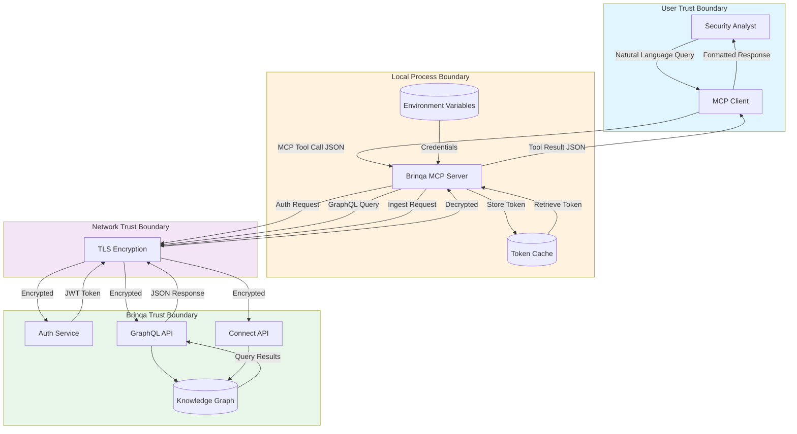
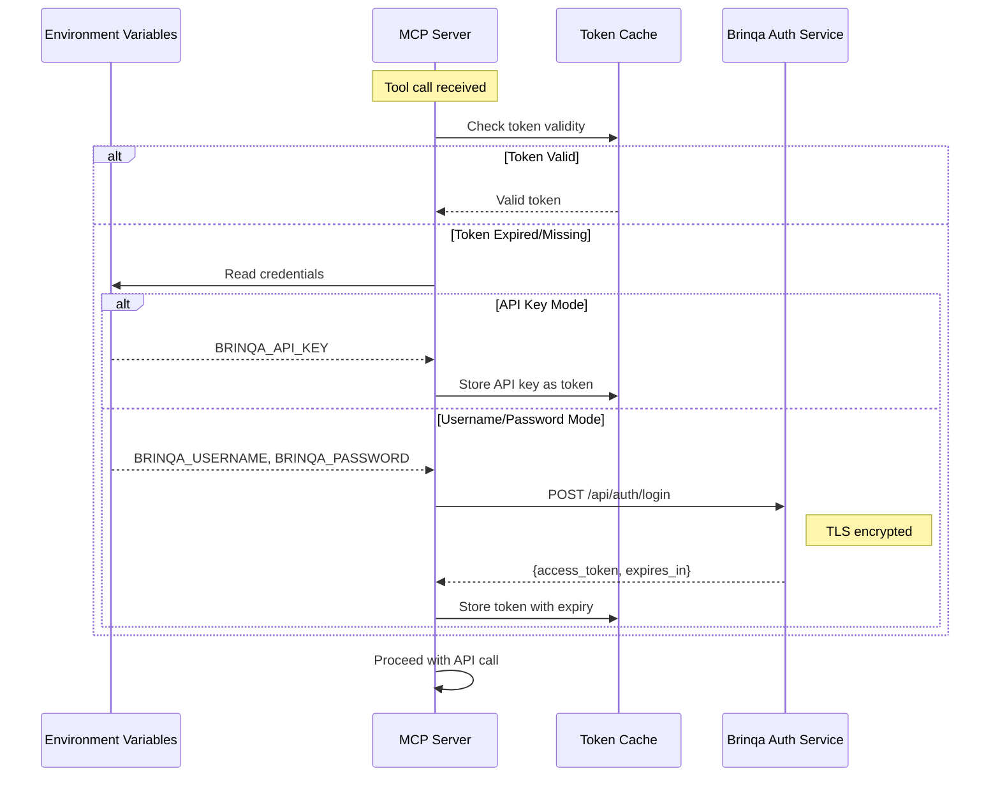
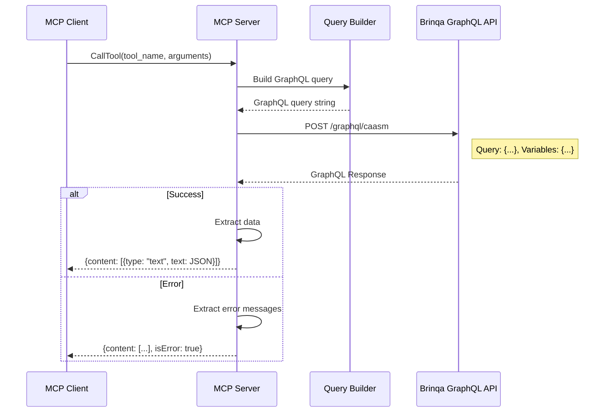
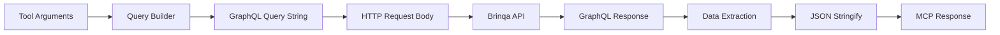
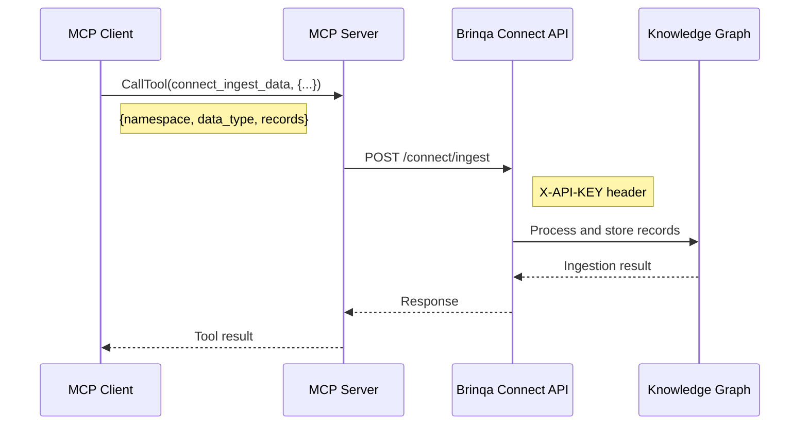
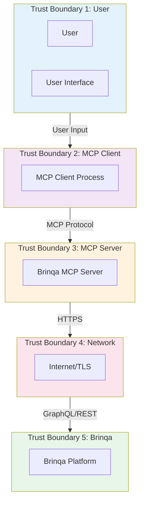
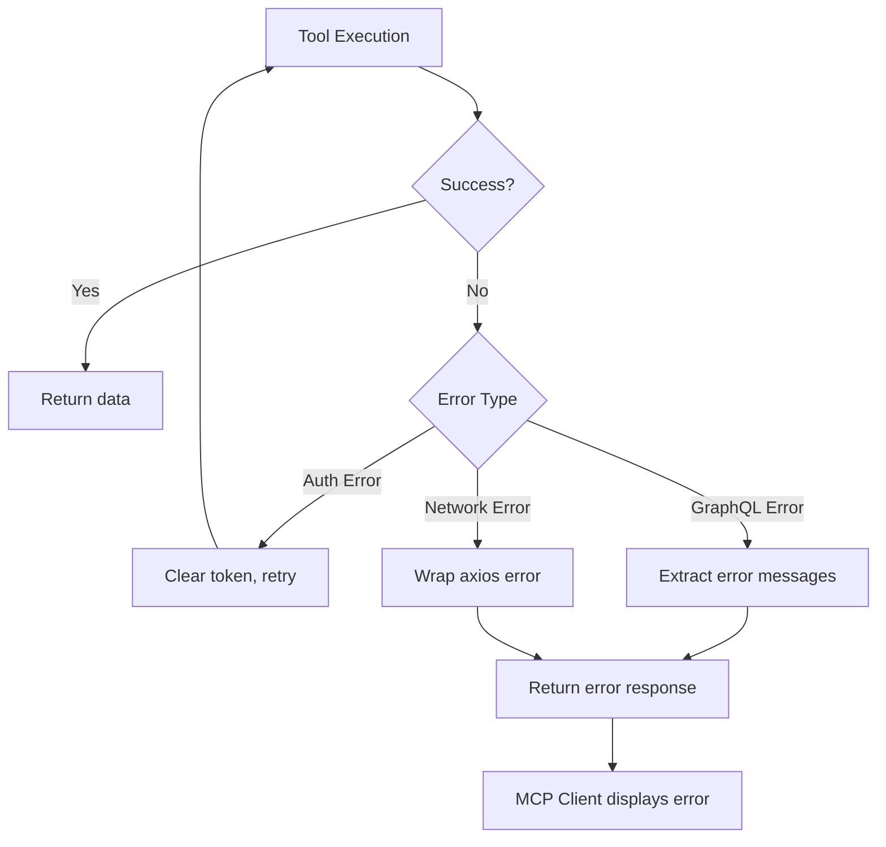

# Data Flow Architecture

This document describes the data flows within the Brinqa MCP Server, including data transformations, trust boundaries, and sensitive data handling.

## Primary Data Flow Diagram



## Data Flow Descriptions

### 1. Authentication Flow



**Data Elements**:

| Element | Source | Destination | Sensitivity | Protection |
|---------|--------|-------------|-------------|------------|
| BRINQA_API_URL | Environment | axios baseURL | Low | None required |
| BRINQA_USERNAME | Environment | Auth request body | High | Process memory only |
| BRINQA_PASSWORD | Environment | Auth request body | High | Process memory, TLS |
| BRINQA_API_KEY | Environment | Token cache, headers | High | Process memory, TLS |
| access_token | Auth service | Token cache, headers | High | Process memory, TLS |

### 2. Query Data Flow



**Data Transformation**:



### 3. Data Ingestion Flow (Brinqa Connect)



## Sensitive Data Paths

### Credential Flow

```mermaid
flowchart TB
    subgraph Secure["Secure Storage (External)"]
        CredManager[Credential Manager]
    end

    subgraph Config["Configuration"]
        ClaudeJSON[~/.claude/.claude.json]
        EnvVars[Environment Variables]
    end

    subgraph Runtime["Runtime (In-Memory)"]
        ProcessEnv[process.env]
        TokenCache[accessToken variable]
        AxiosHeaders[Authorization Header]
    end

    subgraph Transit["Network Transit"]
        AuthReq[Auth Request Body]
        APIReq[API Request Headers]
    end

    CredManager -.->|Manual copy| ClaudeJSON
    ClaudeJSON -->|Loaded by client| EnvVars
    EnvVars -->|Process spawn| ProcessEnv
    ProcessEnv -->|authenticate()| AuthReq
    AuthReq -->|TLS| BrinqaAuth
    BrinqaAuth -->|Token| TokenCache
    TokenCache -->|getAuthHeaders()| AxiosHeaders
    AxiosHeaders -->|TLS| APIReq

    style Secure fill:#c8e6c9
    style Config fill:#fff9c4
    style Runtime fill:#ffccbc
    style Transit fill:#b3e5fc
```

### Sensitive Data Classification

| Data Element | Classification | At Rest | In Transit | In Memory |
|--------------|----------------|---------|------------|-----------|
| Username | Credential | Config file | TLS | Process memory |
| Password | Secret | Config file | TLS | Process memory |
| API Key | Secret | Config file | TLS | Process memory |
| Bearer Token | Secret | None | TLS | Process memory |
| Asset Names | Internal | Brinqa DB | TLS | Process memory |
| Vulnerability Data | Internal | Brinqa DB | TLS | Process memory |
| Risk Scores | Internal | Brinqa DB | TLS | Process memory |
| IP Addresses | PII | Brinqa DB | TLS | Process memory |
| Hostnames | Internal | Brinqa DB | TLS | Process memory |

## Data Retention

### In-Process Retention

| Data | Lifetime | Cleanup |
|------|----------|---------|
| Bearer Token | Until expiry or process end | Overwritten on refresh |
| API Responses | Duration of request handler | Garbage collected |
| GraphQL Queries | Duration of request handler | Garbage collected |

### No Persistent Storage

The MCP server does not:
- Write to disk
- Use databases
- Maintain logs
- Cache query results

## Data Volume Estimates

### Typical Tool Call

| Stage | Data Size | Notes |
|-------|-----------|-------|
| MCP Request | 200-500 bytes | Tool name + arguments |
| GraphQL Query | 500-2000 bytes | Full query string |
| API Response | 10KB - 1MB | Depends on result count |
| MCP Response | 10KB - 1MB | JSON stringified |

### Rate Limiting

| Limit Type | Implementation | Value |
|------------|----------------|-------|
| Client-side | None | Unlimited |
| Brinqa API | Platform-enforced | Unknown (API docs) |
| Result Size | Query builders | 100-1000 results |

## Trust Boundary Analysis



### Boundary Controls

| Boundary Crossing | Control | Validation |
|-------------------|---------|------------|
| User -> MCP Client | Client authentication | User session |
| MCP Client -> MCP Server | stdio isolation | Process isolation |
| MCP Server -> Brinqa | TLS + Bearer Token | API authentication |
| Brinqa -> Knowledge Graph | Internal | Platform authorization |

## Error Data Flows



### Error Response Format

```json
{
  "content": [
    {
      "type": "text",
      "text": "Error: Authentication failed: Invalid credentials"
    }
  ],
  "isError": true
}
```

## Open Questions and Gaps

1. **No Request Logging**: Queries to Brinqa are not logged locally for audit
2. **No Response Caching**: Repeated identical queries always hit the API
3. **No Data Masking**: Sensitive data (IPs, hostnames) returned in full
4. **No Rate Limiting**: No protection against excessive API calls
5. **No Pagination Control**: Large result sets may cause memory issues
6. **Token Refresh Race**: Concurrent requests during refresh may cause issues

---

[Back to Index](./README.md) | [Previous: Deployment](./deployment.md) | [Next: Security](./security.md)
