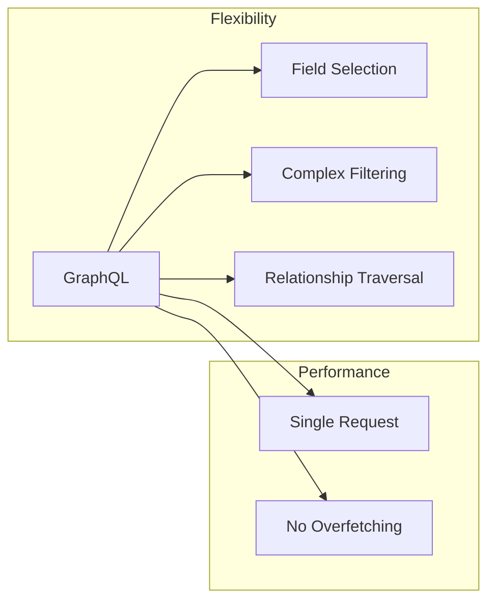
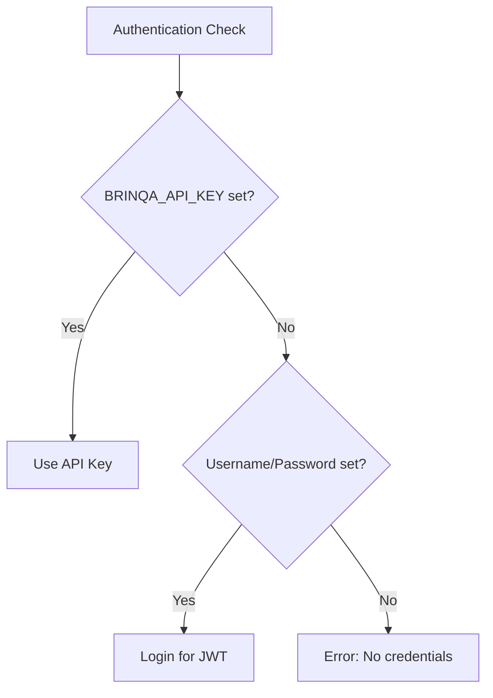

# Architecture Decision Records

This document captures key architecture decisions made for the Brinqa MCP Server, following the ADR (Architecture Decision Record) format.

## Decision Log

| ID | Decision | Status | Date |
|----|----------|--------|------|
| ADR-001 | Use TypeScript for implementation | Accepted | 2024-01 |
| ADR-002 | Single-file architecture | Accepted | 2024-01 |
| ADR-003 | GraphQL for Brinqa API integration | Accepted | 2024-01 |
| ADR-004 | In-memory token caching | Accepted | 2024-01 |
| ADR-005 | Environment variables for credentials | Accepted | 2024-01 |
| ADR-006 | Dual authentication modes | Accepted | 2024-01 |

---

## ADR-001: Use TypeScript for Implementation

### Context

The MCP SDK is available in TypeScript/JavaScript and Python. We need to choose a language for implementing the Brinqa MCP server.

### Decision

We will use **TypeScript** with strict mode enabled for the implementation.

### Rationale

| Factor | TypeScript | Python |
|--------|------------|--------|
| MCP SDK Maturity | Primary SDK | Available |
| Type Safety | Strong (strict mode) | Optional (type hints) |
| Runtime | Node.js | Python 3.x |
| Developer Experience | Excellent tooling | Good tooling |
| Ecosystem | npm packages | pip packages |
| GraphQL Libraries | Mature | Mature |

TypeScript provides:
- Compile-time type checking
- Better IDE support
- Clear interface definitions
- Native async/await support

### Consequences

**Positive:**
- Type safety catches errors at compile time
- Clear API contracts via TypeScript interfaces
- Source maps for debugging
- Declaration files for consumers

**Negative:**
- Build step required (tsc)
- Slightly larger learning curve
- Node.js runtime dependency

### Status

Accepted

---

## ADR-002: Single-File Architecture

### Context

We need to decide on the code organization for the MCP server. Options include:
1. Single file (monolith)
2. Multiple modules with barrel exports
3. Full package structure with separate concerns

### Decision

We will implement the entire server in a **single TypeScript file** (`src/index.ts`).

### Rationale

| Factor | Consideration |
|--------|---------------|
| Codebase Size | ~1100 lines - manageable in one file |
| Complexity | Low - straightforward request/response |
| Dependencies | Minimal - only SDK and axios |
| Deployment | Simpler with single output file |
| Debugging | Easier stack traces |

The server has:
- One entry point
- One client class
- Ten tools with similar patterns
- Eight query builders with similar structure

### Consequences

**Positive:**
- Simple to understand
- Easy to navigate
- No import complexity
- Single compilation unit

**Negative:**
- Limited testability (no module mocking)
- Harder to extend significantly
- No separation of concerns
- Refactoring difficulty at scale

### Alternatives Considered

1. **Separate modules per tool**: Rejected - overhead not justified
2. **Client in separate file**: Considered - could be extracted later
3. **Query builders as module**: Considered - pure functions could be extracted

### Status

Accepted (with potential for future refactoring)

---

## ADR-003: GraphQL for Brinqa API Integration

### Context

Brinqa Platform provides multiple API options:
1. GraphQL API (`/graphql/caasm`)
2. REST API (various endpoints)
3. Brinqa Connect API (`/connect/*`)

### Decision

We will use the **GraphQL API** as the primary interface, with REST for Connect operations only.

### Rationale



| Factor | GraphQL | REST |
|--------|---------|------|
| Field Selection | Client-controlled | Server-defined |
| Multiple Resources | Single query | Multiple requests |
| Filtering | Flexible | Endpoint-specific |
| Documentation | Schema-driven | Swagger/OpenAPI |
| Brinqa Recommendation | Primary API | Legacy/specific use |

### Consequences

**Positive:**
- Flexible queries matching tool requirements
- Single request for complex data
- Self-documenting via schema
- Consistent interface across tools

**Negative:**
- Query complexity on client side
- Potential for inefficient queries
- Learning curve for GraphQL syntax

### Status

Accepted

---

## ADR-004: In-Memory Token Caching

### Context

Brinqa authentication returns JWT tokens valid for 24 hours. We need to manage token lifecycle.

### Decision

Store tokens **in process memory** with expiry tracking and automatic refresh.

### Rationale

| Approach | Pros | Cons |
|----------|------|------|
| In-memory | Simple, secure | Lost on restart |
| File cache | Persistent | Security risk |
| Keychain | Secure, persistent | Platform-specific |

```typescript
// Current implementation
private accessToken: string | null = null;
private tokenExpiry: number = 0;
```

Token refresh occurs 5 minutes before expiry to avoid request failures.

### Consequences

**Positive:**
- No disk I/O
- No cross-process leakage
- Automatic cleanup on exit
- Simple implementation

**Negative:**
- Re-authentication on every restart
- No token sharing between instances
- Memory consumption (minimal)

### Status

Accepted

---

## ADR-005: Environment Variables for Credentials

### Context

Credentials (username/password or API key) must be provided to the MCP server. Storage options:
1. Command-line arguments
2. Environment variables
3. Configuration file
4. System keychain
5. Interactive prompt

### Decision

Use **environment variables** passed via MCP client configuration.

### Rationale

| Method | Security | Usability | MCP Compatible |
|--------|----------|-----------|----------------|
| Command args | Low (visible) | Medium | Yes |
| Env vars | Medium | High | Yes |
| Config file | Medium | High | Indirect |
| Keychain | High | Medium | No (interactive) |
| Prompt | High | Low | No |

MCP client configuration already supports environment variable injection:
```json
{
  "env": {
    "BRINQA_API_URL": "...",
    "BRINQA_USERNAME": "...",
    "BRINQA_PASSWORD": "..."
  }
}
```

### Consequences

**Positive:**
- Native MCP client support
- No file parsing required
- Cross-platform compatibility
- Standard credential injection pattern

**Negative:**
- Plain text in config files
- Visible in process listings (`ps aux`)
- No encryption at rest
- User responsible for security

### Recommended Mitigation

Future enhancement: Support reading credentials from system keychain or secrets manager.

### Status

Accepted (with security gap acknowledged)

---

## ADR-006: Dual Authentication Modes

### Context

Brinqa supports multiple authentication mechanisms:
1. Username/password (returns JWT)
2. API key (for Brinqa Connect)

### Decision

Support **both authentication modes** with automatic detection based on environment variables.

### Rationale



| Mode | Use Case | Token Type |
|------|----------|------------|
| Username/Password | User access | JWT (24h) |
| API Key | Brinqa Connect | Permanent key |

### Consequences

**Positive:**
- Flexibility for different Brinqa configurations
- Support for both personal and service accounts
- Connect API works with API key only

**Negative:**
- More complex credential validation
- Two code paths for authentication
- Potential confusion about which to use

### Implementation

```typescript
if (BRINQA_API_KEY) {
  // Use API key directly
  this.accessToken = BRINQA_API_KEY;
} else {
  // Login with username/password
  const response = await login(username, password);
  this.accessToken = response.access_token;
}
```

### Status

Accepted

---

## Future Decision Candidates

### Pending Decisions

| ID | Topic | Status | Trigger |
|----|-------|--------|---------|
| ADR-007 | Structured logging | Proposed | Observability requirement |
| ADR-008 | Module extraction | Proposed | Codebase growth |
| ADR-009 | Keychain integration | Proposed | Security enhancement |
| ADR-010 | Response caching | Proposed | Performance optimization |
| ADR-011 | Rate limiting | Proposed | API stability |

### ADR-007: Structured Logging (Proposed)

**Context**: Current logging is `console.error` only. Need structured logs for production debugging.

**Options**:
1. Pino (lightweight, fast)
2. Winston (feature-rich)
3. Console with JSON format

**Recommendation**: Pino for its performance and MCP server process model.

### ADR-008: Module Extraction (Proposed)

**Context**: Single file may become unwieldy as tools are added.

**Proposed Structure**:
```
src/
├── index.ts          # Entry point
├── client.ts         # BrinqaClient class
├── tools/            # Tool definitions
│   ├── assets.ts
│   ├── vulnerabilities.ts
│   └── ...
└── queries/          # Query builders
    ├── assets.ts
    └── ...
```

**Trigger**: When file exceeds 2000 lines or 15 tools.

---

## Decision Review Process

### Review Criteria

| Criterion | Threshold |
|-----------|-----------|
| Security Impact | Any change to auth/data handling |
| Performance Impact | >100ms latency change |
| API Change | Breaking changes to tools |
| Dependency Addition | New runtime dependencies |

### Review Schedule

- Quarterly review of all ADRs
- Triggered review on major version change
- Immediate review on security incidents

## Open Questions and Gaps

1. **No Formal ADR Template**: Using simplified format
2. **No ADR Tooling**: Manual markdown maintenance
3. **No Decision Governance**: No approval workflow
4. **Missing Rationale Documentation**: Some early decisions not documented
5. **No Change Impact Analysis**: No systematic impact assessment

---

[Back to Index](./README.md) | [Previous: TOGAF Mapping](./togaf-mapping.md)
