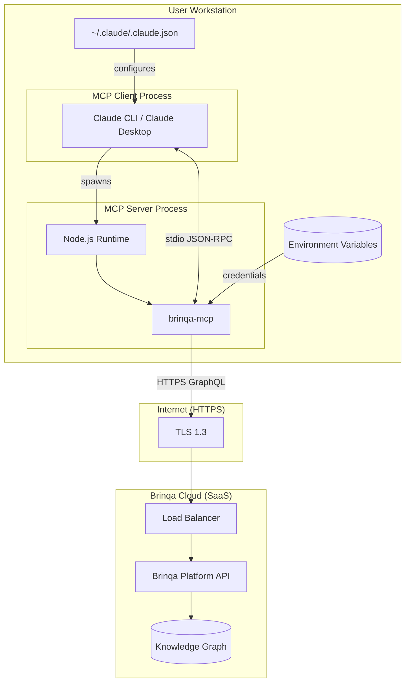
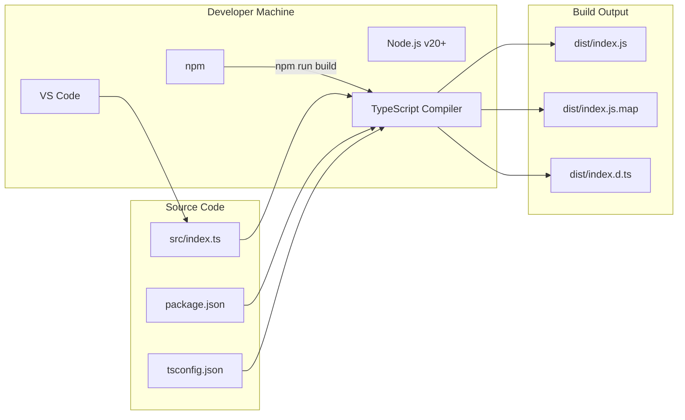
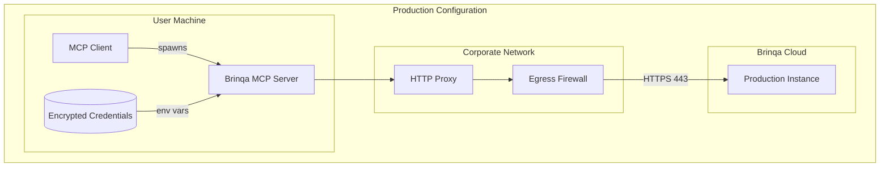
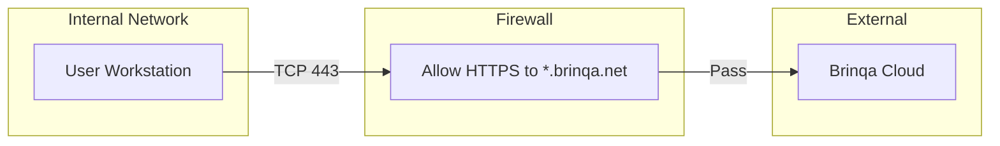
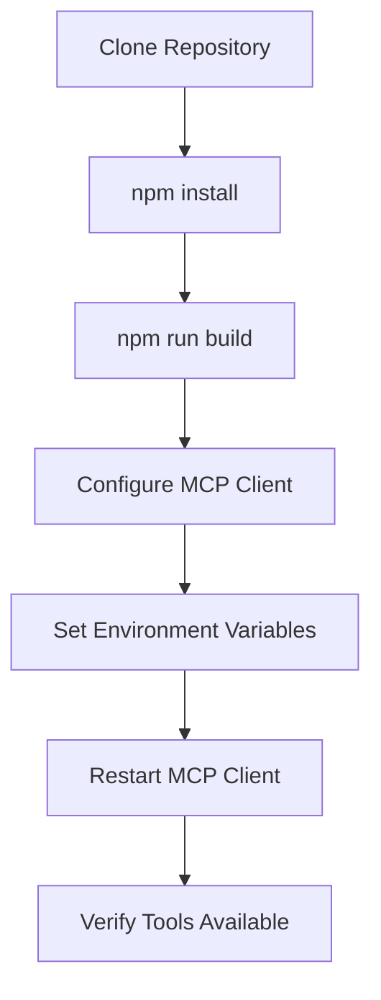
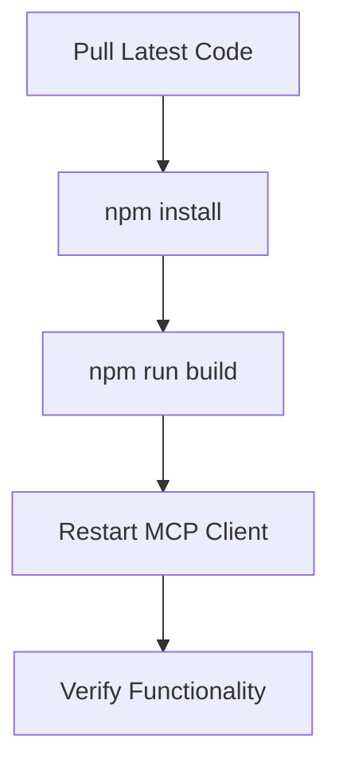

# Deployment Architecture

This document describes the deployment model for the Brinqa MCP Server across different environments and configurations.

## Deployment Diagram



## Environment Configurations

### Local Development



| Aspect | Configuration |
|--------|---------------|
| **Runtime** | Node.js v20+ |
| **Build** | `npm run build` (TypeScript compilation) |
| **Start** | `npm start` or `node dist/index.js` |
| **Watch Mode** | `npm run dev` (tsc --watch) |
| **Debugging** | Source maps enabled (`sourceMap: true`) |

### Production (MCP Client Hosted)

The MCP server does not have a traditional "production" deployment. Instead, it runs as a child process of the MCP client on user workstations.



| Aspect | Configuration |
|--------|---------------|
| **Deployment** | Distributed with MCP client config |
| **Credentials** | Environment variables (may use credential manager) |
| **Network** | May traverse corporate proxy |
| **Updates** | Manual (npm update) or via package manager |

## Deployment Configurations

### Claude CLI Configuration

**File**: `~/.claude/.claude.json`

```json
{
  "mcpServers": {
    "brinqa": {
      "command": "node",
      "args": ["/absolute/path/to/brinqa-mcp/dist/index.js"],
      "env": {
        "BRINQA_API_URL": "https://your-instance.brinqa.net",
        "BRINQA_USERNAME": "your-username",
        "BRINQA_PASSWORD": "your-password"
      }
    }
  }
}
```

### Alternative: API Key Configuration

```json
{
  "mcpServers": {
    "brinqa": {
      "command": "node",
      "args": ["/absolute/path/to/brinqa-mcp/dist/index.js"],
      "env": {
        "BRINQA_API_URL": "https://your-instance.brinqa.net",
        "BRINQA_API_KEY": "your-api-key"
      }
    }
  }
}
```

### VS Code / Cursor Configuration

**File**: `.vscode/mcp-servers.json` or equivalent

```json
{
  "servers": {
    "brinqa": {
      "command": "node",
      "args": ["${workspaceFolder}/dist/index.js"],
      "env": {
        "BRINQA_API_URL": "${env:BRINQA_API_URL}",
        "BRINQA_USERNAME": "${env:BRINQA_USERNAME}",
        "BRINQA_PASSWORD": "${env:BRINQA_PASSWORD}"
      }
    }
  }
}
```

## Network Requirements

### Egress Requirements

| Destination | Port | Protocol | Purpose |
|-------------|------|----------|---------|
| `*.brinqa.net` | 443 | HTTPS | Brinqa Platform API |
| npm registry (build only) | 443 | HTTPS | Package installation |

### Proxy Support

The MCP server uses axios which respects standard proxy environment variables:

```bash
export HTTPS_PROXY=http://proxy.corporate.com:8080
export NO_PROXY=localhost,127.0.0.1
```

### Firewall Rules



## Infrastructure Dependencies

### Build-Time Dependencies

| Dependency | Version | Purpose |
|------------|---------|---------|
| Node.js | ^20.0.0 | JavaScript runtime |
| npm | ^10.0.0 | Package manager |
| TypeScript | ^5.3.0 | Type checking and compilation |

### Runtime Dependencies

| Dependency | Version | Purpose |
|------------|---------|---------|
| Node.js | ^20.0.0 | JavaScript runtime |
| @modelcontextprotocol/sdk | ^1.0.0 | MCP protocol implementation |
| axios | ^1.6.0 | HTTP client |

### External Service Dependencies

| Service | SLA Dependency | Fallback |
|---------|----------------|----------|
| Brinqa Platform | Required for operation | None (tools return errors) |
| DNS | Required for resolution | Cached entries |

## Deployment Process

### Initial Installation



### Update Process



## Resource Requirements

### Workstation Requirements

| Resource | Minimum | Recommended |
|----------|---------|-------------|
| Memory | 128 MB (server only) | 256 MB |
| CPU | Any modern CPU | - |
| Disk | 50 MB | 100 MB |
| Network | Broadband | Low latency to Brinqa |

### Process Limits

| Limit | Value | Notes |
|-------|-------|-------|
| Memory | Unbounded | Node.js default heap |
| File Descriptors | OS default | Network sockets |
| Process Count | 1 | Single Node.js process |

## Monitoring and Observability

### Current State

| Aspect | Implementation |
|--------|----------------|
| Logging | `console.error` to stderr |
| Metrics | None |
| Tracing | None |
| Health Checks | None (stdio process) |

### Log Output

```
Brinqa MCP server started
Error: Authentication failed: Invalid credentials
Error: GraphQL errors: Field 'xyz' not found
```

Logs go to stderr and are typically captured by the MCP client.

## Disaster Recovery

### Failure Scenarios

| Scenario | Impact | Recovery |
|----------|--------|----------|
| MCP Server Crash | Tools unavailable | MCP client restarts server automatically |
| Brinqa API Outage | Tools return errors | Wait for Brinqa recovery |
| Invalid Credentials | Authentication errors | Reconfigure environment variables |
| Network Partition | Connection timeouts | Restore network connectivity |

### Backup Considerations

No local data persistence; all state is in:
- Source code (version controlled)
- Configuration (MCP client config)
- Credentials (environment variables)

## Open Questions and Gaps

1. **No Containerization**: No Docker/container support for consistent deployment
2. **No Version Pinning**: Floating dependency versions in package.json
3. **No CI/CD**: No automated build/test/deploy pipeline
4. **No Credential Management**: Plain text credentials in config files
5. **No Auto-Update**: Manual update process required

---

[Back to Index](./README.md) | [Previous: Components](./components.md) | [Next: Data Flows](./data-flows.md)
