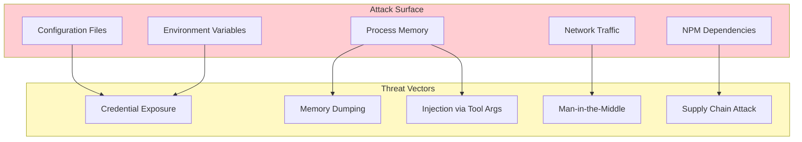
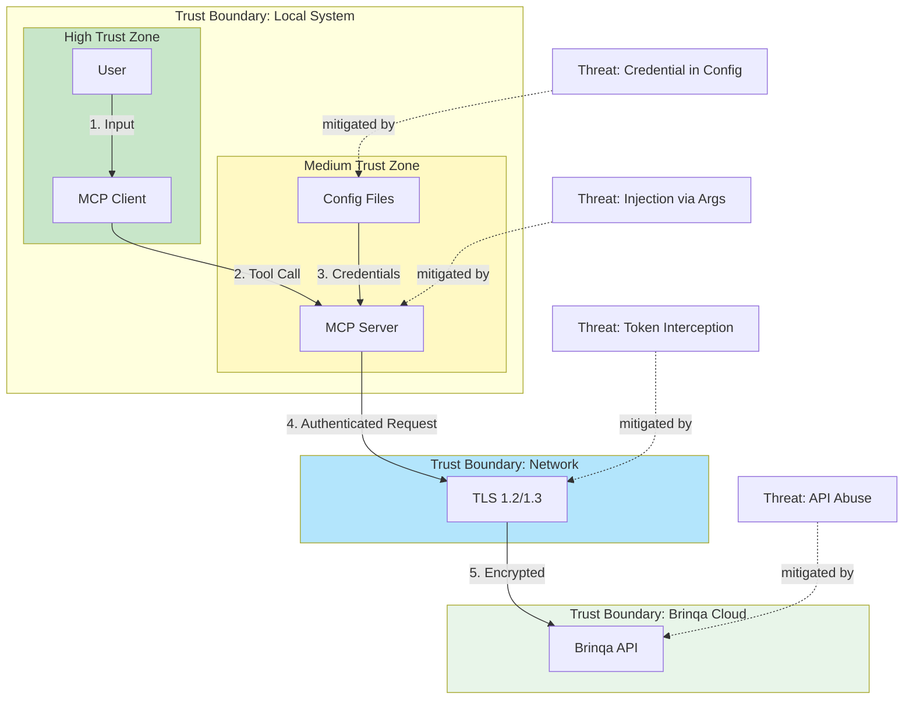
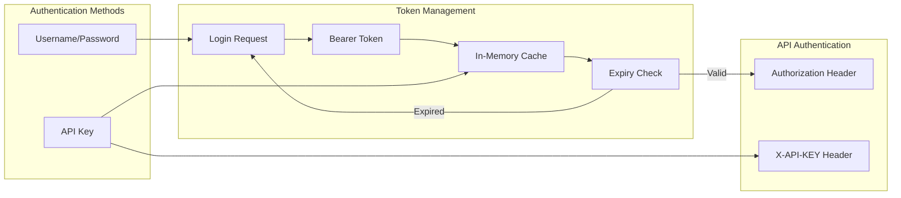
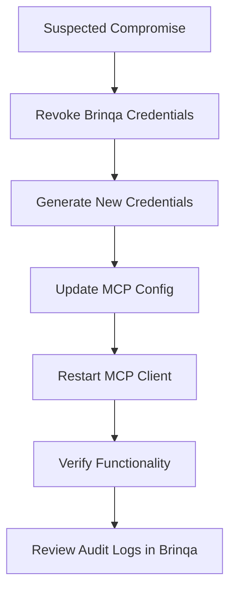
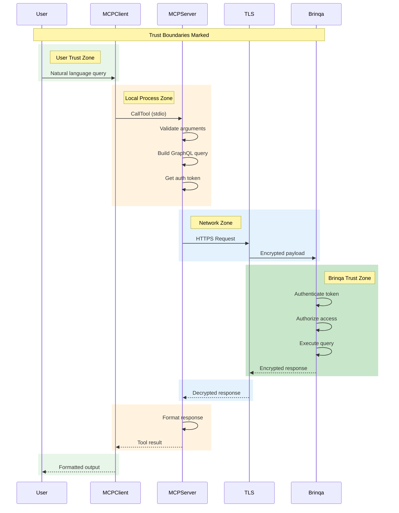

# Security Architecture

This document describes the security architecture, threat model, and security controls for the Brinqa MCP Server.

## Threat Model Summary

### Key Assets

| Asset | Sensitivity | Impact if Compromised |
|-------|-------------|----------------------|
| Brinqa Credentials | Critical | Full access to vulnerability data |
| Bearer Token | High | Temporary access to Brinqa API |
| Vulnerability Data | High | Exposure of security posture |
| Asset Inventory | Medium | Exposure of infrastructure details |
| Risk Scores | Medium | Competitive intelligence leak |

### Adversaries

| Adversary | Capability | Motivation |
|-----------|------------|------------|
| Malicious Insider | High | Data exfiltration, sabotage |
| External Attacker | Medium | Vulnerability intelligence |
| Malware on Workstation | Medium | Credential theft |
| Compromised MCP Client | Low | Data interception |

### Attack Surface



## Threat Model View



## STRIDE Analysis

| Threat Category | Applicable | Risk | Mitigation |
|-----------------|------------|------|------------|
| **Spoofing** | Yes | Medium | Bearer token auth, TLS client validation |
| **Tampering** | Yes | Low | TLS integrity, no local persistence |
| **Repudiation** | Yes | Medium | No local audit logs (gap) |
| **Information Disclosure** | Yes | High | TLS, process isolation, no disk storage |
| **Denial of Service** | Yes | Low | Process isolation, Brinqa rate limiting |
| **Elevation of Privilege** | Yes | Medium | No privilege escalation in server |

## Authentication and Authorization

### Authentication Architecture



### Authentication Controls

| Control | Implementation | Status |
|---------|----------------|--------|
| Token-based Auth | Bearer tokens in Authorization header | Implemented |
| API Key Auth | X-API-KEY header for Connect API | Implemented |
| Token Refresh | Automatic refresh 5 min before expiry | Implemented |
| Token Retry | 401 triggers re-authentication | Implemented |
| Credential Validation | Environment variable check at startup | Implemented |

### Authorization Model

| Actor | Permissions | Enforcement |
|-------|-------------|-------------|
| MCP Server | All tools enabled | Tool definitions |
| Brinqa User | API permissions | Brinqa platform RBAC |
| Tool Caller | Any registered tool | MCP protocol |

**Note**: The MCP server does not implement its own authorization layer. All authorization is delegated to the Brinqa platform based on the authenticated user's permissions.

## Data Protection

### Encryption

| Data State | Encryption | Algorithm | Key Management |
|------------|------------|-----------|----------------|
| In Transit | TLS | TLS 1.2/1.3 | Brinqa platform certificates |
| At Rest (Credentials) | None | N/A | User responsibility |
| In Memory | None | N/A | Process isolation |

### Data Classification Handling

| Classification | Handling | Current Implementation |
|----------------|----------|----------------------|
| Credentials | Encrypted storage recommended | Plain text in env vars (gap) |
| Bearer Tokens | Short-lived, in-memory | 24-hour tokens, memory only |
| Vulnerability Data | Access controlled | Brinqa RBAC, no local caching |
| PII (IP addresses, hostnames) | Minimize exposure | Full data returned (gap) |

## Supply Chain Security

### Dependency Analysis

```mermaid
flowchart TB
    subgraph DirectDeps["Direct Dependencies"]
        SDK[@modelcontextprotocol/sdk]
        Axios[axios]
    end

    subgraph TransitiveDeps["Key Transitive Dependencies"]
        Zod[zod]
        Express[express]
        FormData[form-data]
    end

    subgraph DevDeps["Dev Dependencies"]
        TypeScript[typescript]
        Types[@types/node]
    end

    SDK --> Zod
    SDK --> Express
    Axios --> FormData

    style DirectDeps fill:#c8e6c9
    style TransitiveDeps fill:#fff9c4
    style DevDeps fill:#e3f2fd
```

### Supply Chain Controls

| Control | Status | Notes |
|---------|--------|-------|
| Package Lock | Yes | package-lock.json present |
| Version Pinning | Partial | Caret (^) versions used |
| Vulnerability Scanning | No | No automated scanning |
| SBOM Generation | No | Not implemented |
| Dependency Audit | Manual | `npm audit` available |

### Recommended Actions

```bash
# Audit dependencies
npm audit

# Fix vulnerabilities
npm audit fix

# Check for outdated packages
npm outdated
```

## Security Controls Matrix

### Implemented Controls

| Control | Category | Implementation |
|---------|----------|----------------|
| TLS Encryption | Transit Security | axios default HTTPS |
| Token Authentication | Identity | Bearer tokens |
| Token Expiry | Session Management | 24-hour expiry |
| Auto-Refresh | Session Management | 5-min pre-expiry refresh |
| Error Handling | Availability | Try-catch, error responses |
| Type Safety | Code Security | TypeScript strict mode |

### Missing Controls (Gaps)

| Control | Category | Risk | Recommendation |
|---------|----------|------|----------------|
| Credential Encryption | Secrets Management | High | Use system keychain |
| Audit Logging | Non-Repudiation | Medium | Add structured logging |
| Rate Limiting | Availability | Medium | Implement client-side limits |
| Input Validation | Injection Prevention | Low | Validate tool arguments |
| Request Signing | Integrity | Low | Consider for high-security deployments |

## Security Hardening Checklist

### Configuration Hardening

- [ ] Store credentials in system keychain instead of config files
- [ ] Use read-only file permissions on config files
- [ ] Validate BRINQA_API_URL format before use
- [ ] Implement minimum TLS version enforcement

### Runtime Hardening

- [ ] Add process signal handlers for clean shutdown
- [ ] Implement request timeout limits
- [ ] Add memory usage monitoring
- [ ] Zero credentials after use (memory)

### Network Hardening

- [ ] Validate TLS certificates (currently axios default)
- [ ] Implement certificate pinning for high-security deployments
- [ ] Support proxy authentication if required
- [ ] Log network errors for monitoring

## Incident Response

### Security Events

| Event | Detection | Response |
|-------|-----------|----------|
| Authentication Failure | Error response "Authentication failed" | Check credentials, alert user |
| Token Expired | 401 response | Automatic re-authentication |
| API Error | GraphQL errors array | Log and return to user |
| Network Timeout | axios timeout | Retry with backoff |

### Credential Compromise Response



## Compliance Considerations

### Regulatory Mapping

| Regulation | Relevance | Controls |
|------------|-----------|----------|
| SOC 2 | Vulnerability data handling | TLS, access control |
| GDPR | PII in asset data | Brinqa data handling |
| HIPAA | If healthcare assets | Brinqa BAA required |
| PCI-DSS | If cardholder environment | Network segmentation |

### Audit Requirements

| Requirement | Current State | Gap |
|-------------|---------------|-----|
| Access Logging | Brinqa platform only | No local logs |
| Change Tracking | Git for code | No runtime tracking |
| Credential Rotation | Manual | No automated rotation |

## Sequence: Secure Query Flow



## Open Questions and Gaps

1. **Credential Storage**: Plain text credentials in config files is a security gap
2. **No Audit Trail**: Local query logging not implemented
3. **No Input Sanitization**: Tool arguments passed directly to query builders
4. **No Secret Rotation**: Manual credential updates required
5. **Dependency Vulnerabilities**: No automated scanning configured
6. **No Security Headers**: Not applicable (stdio transport)
7. **Token Storage**: In-memory only, lost on restart (acceptable)

---

[Back to Index](./README.md) | [Previous: Data Flows](./data-flows.md) | [Next: TOGAF Mapping](./togaf-mapping.md)
