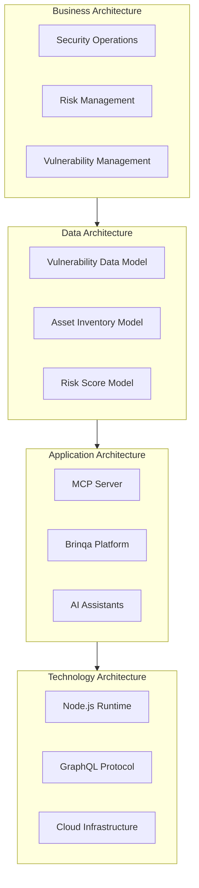
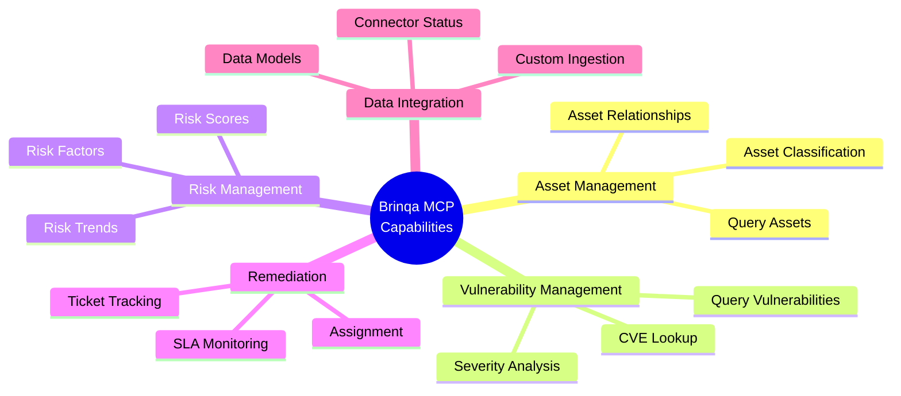
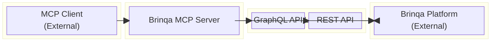
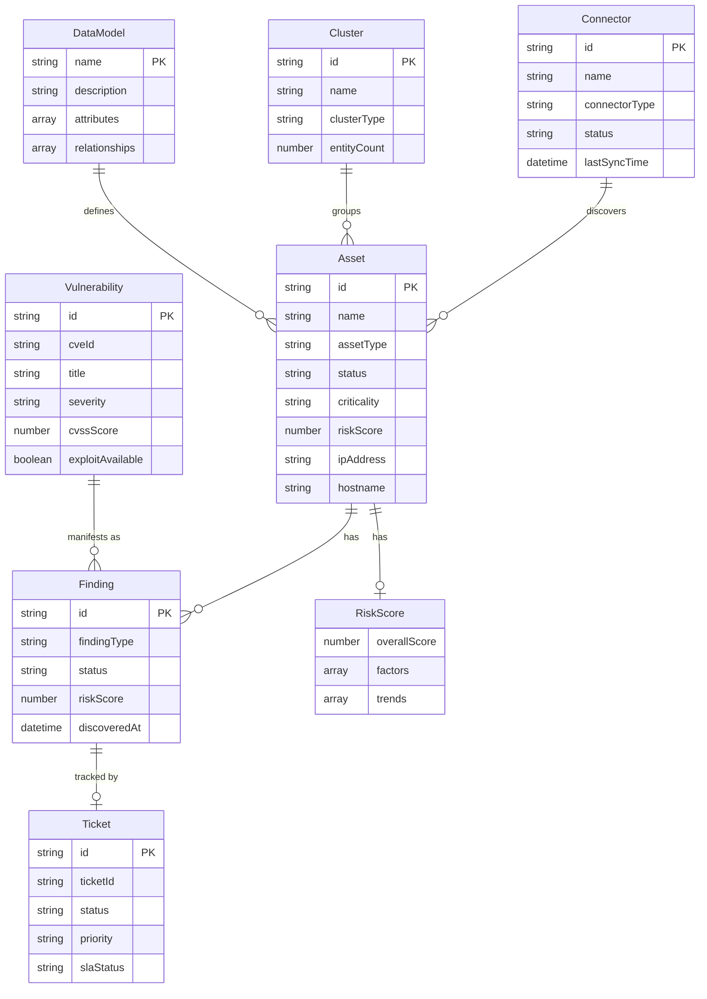
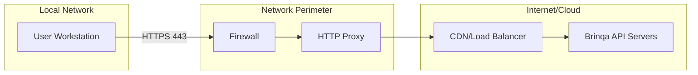
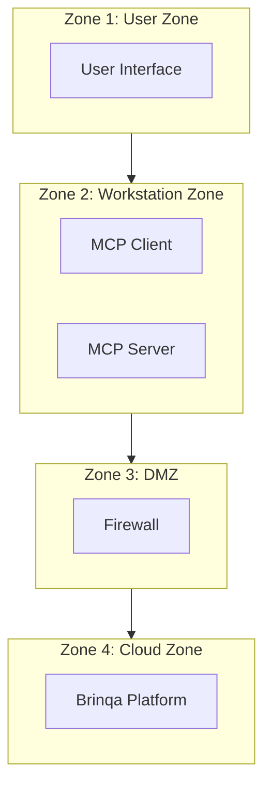
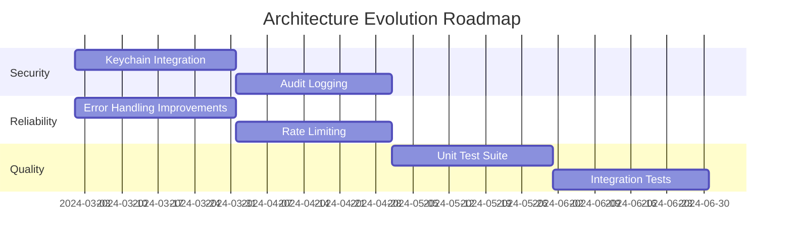

# TOGAF Architecture Mapping

This document maps the Brinqa MCP Server architecture to TOGAF (The Open Group Architecture Framework) views and building blocks.

## TOGAF Architecture Overview



## Business Architecture

### Stakeholders

| Stakeholder | Role | Concerns |
|-------------|------|----------|
| Security Analyst | Primary User | Quick access to vulnerability data |
| Security Manager | Decision Maker | Risk visibility, SLA compliance |
| CISO | Executive Sponsor | Overall security posture |
| DevOps Engineer | Technical User | Asset and vulnerability correlation |
| Compliance Officer | Governance | Audit trails, data accuracy |
| Developer | Integration User | API access, custom queries |

### Business Drivers

| Driver | Description | Architecture Impact |
|--------|-------------|---------------------|
| **Efficiency** | Reduce time to query vulnerability data | MCP integration for natural language access |
| **Visibility** | Unified view of security posture | GraphQL for flexible querying |
| **Automation** | Enable AI-assisted security workflows | Tool-based API design |
| **Integration** | Connect Brinqa with AI assistants | MCP protocol compliance |
| **Governance** | Maintain audit capabilities | Token-based authentication |

### Business Capabilities



### Constraints

| Constraint | Type | Impact |
|------------|------|--------|
| MCP Protocol | Technical | Must implement stdio transport |
| Brinqa API Limits | External | Query size restrictions |
| Single Instance | Architectural | One server per MCP client |
| Credential Security | Compliance | Environment variable storage |

## Application Architecture

### Building Blocks



### Application Components

| Component | Type | Description |
|-----------|------|-------------|
| **Brinqa MCP Server** | Integration Service | Translates MCP tool calls to Brinqa API |
| **BrinqaClient** | API Client | Handles authentication and HTTP requests |
| **Query Builders** | Transformation | Constructs GraphQL queries |
| **Tool Definitions** | Interface | Defines available MCP tools |
| **Request Handlers** | Controller | Routes and processes tool calls |

### Service Contracts

#### MCP Tools Interface

| Tool | Input Schema | Output |
|------|--------------|--------|
| query_assets | AssetQueryParams | Asset[] |
| query_vulnerabilities | VulnQueryParams | Vulnerability[] |
| query_findings | FindingQueryParams | Finding[] |
| get_risk_scores | RiskQueryParams | RiskScore |
| query_tickets | TicketQueryParams | Ticket[] |
| get_connectors | ConnectorQueryParams | Connector[] |
| execute_graphql | GraphQLParams | Any |
| get_clusters | ClusterQueryParams | Cluster[] |
| connect_ingest_data | IngestParams | IngestResult |
| get_data_models | ModelQueryParams | DataModel[] |

#### Brinqa API Contracts

| Endpoint | Method | Authentication |
|----------|--------|----------------|
| /api/auth/login | POST | Username/Password |
| /graphql/caasm | POST | Bearer Token |
| /connect/ingest | POST | API Key |

### Application Interaction Matrix

| From \ To | MCP Client | MCP Server | Brinqa API |
|-----------|------------|------------|------------|
| **MCP Client** | - | Tool calls (stdio) | - |
| **MCP Server** | Tool results | - | GraphQL/REST |
| **Brinqa API** | - | Responses | - |

## Data Architecture

### Logical Data Model



### Data Stores

| Store | Type | Owner | Data |
|-------|------|-------|------|
| Brinqa Knowledge Graph | Graph DB | Brinqa | Assets, vulnerabilities, findings |
| Token Cache | In-memory | MCP Server | Bearer tokens |
| Configuration | File | User | Credentials, API URL |

### Data Flows by Entity

| Entity | Source | Flow Direction | Destination |
|--------|--------|----------------|-------------|
| Assets | Brinqa | Read | MCP Client |
| Vulnerabilities | Brinqa | Read | MCP Client |
| Findings | Brinqa | Read | MCP Client |
| Risk Scores | Brinqa | Read | MCP Client |
| Tickets | Brinqa | Read | MCP Client |
| Custom Data | MCP Client | Write | Brinqa |

### Data Retention

| Data | Retention | Location |
|------|-----------|----------|
| Query Results | Request duration | Process memory |
| Bearer Token | 24 hours | Process memory |
| Credentials | Persistent | Config file |
| Audit Logs | N/A | Not implemented |

### Data Classification

| Classification | Examples | Controls |
|----------------|----------|----------|
| **Confidential** | Credentials, tokens | Encryption recommended |
| **Internal** | Vulnerabilities, risk scores | Access control |
| **PII** | IP addresses, hostnames | Brinqa RBAC |

## Technology Architecture

### Runtime Environment

```mermaid
flowchart TB
    subgraph Runtime["Technology Stack"]
        Node[Node.js v20+]
        V8[V8 Engine]
        EventLoop[Event Loop]
    end

    subgraph Language["Language Layer"]
        TS[TypeScript ES2022]
        JS[Compiled JavaScript]
    end

    subgraph Protocols["Protocol Layer"]
        MCP[MCP/JSON-RPC]
        HTTP[HTTPS/TLS]
        GQL[GraphQL]
    end

    subgraph Libraries["Library Layer"]
        SDK[@modelcontextprotocol/sdk]
        Axios[axios]
    end

    Node --> V8
    V8 --> EventLoop
    TS --> JS
    JS --> Node
    SDK --> MCP
    Axios --> HTTP
    HTTP --> GQL
```

### Platform Services

| Service | Provider | Purpose |
|---------|----------|---------|
| Node.js Runtime | Local/Docker | JavaScript execution |
| Brinqa Platform | Brinqa Cloud | Vulnerability management |
| DNS | Corporate/Public | Name resolution |
| TLS/PKI | Brinqa | Certificate management |

### Network Architecture



### Technology Standards

| Category | Standard | Version |
|----------|----------|---------|
| Runtime | Node.js | 20.x LTS |
| Language | TypeScript | 5.3.x |
| API | GraphQL | October 2021 |
| Transport | HTTPS | TLS 1.2/1.3 |
| Serialization | JSON | RFC 8259 |
| Protocol | MCP | 1.0 |

## Security Architecture

### Security Controls Mapping

| TOGAF Security Pattern | Implementation |
|------------------------|----------------|
| Identity Management | Brinqa user authentication |
| Access Control | Brinqa RBAC, token validation |
| Data Protection | TLS encryption, no local storage |
| Security Monitoring | Brinqa platform logging |
| Vulnerability Management | Self-referential (queries itself) |

### Trust Zones



### Security Policies

| Policy | Enforcement |
|--------|-------------|
| Authentication Required | Token check on every API call |
| Encryption in Transit | TLS for all external communication |
| Least Privilege | Tool-specific queries only |
| Session Timeout | 24-hour token expiry |

## Architecture Roadmap

### Current State (Baseline)

| Dimension | State |
|-----------|-------|
| Integration | MCP 1.0 compliant |
| Security | Token auth, TLS |
| Scalability | Single instance |
| Observability | Console logging only |

### Target State

| Dimension | Target | Gap |
|-----------|--------|-----|
| Integration | Multi-instance support | MCP limitation |
| Security | Keychain credential storage | Implementation needed |
| Scalability | Caching layer | Not applicable (MCP model) |
| Observability | Structured logging, metrics | Implementation needed |

### Migration Path



## TOGAF ADM Alignment

### Phase Mapping

| ADM Phase | Activities Completed |
|-----------|---------------------|
| **Preliminary** | Architecture principles defined |
| **A: Vision** | Stakeholder analysis, capability map |
| **B: Business** | Business drivers, constraints |
| **C: Information Systems** | Application and data models |
| **D: Technology** | Runtime and network architecture |
| **E: Opportunities** | Gap analysis, roadmap |
| **F: Migration** | Implementation approach |
| **G: Implementation** | Code implementation |
| **H: Change** | Version management (Git) |

### Architecture Principles

| Principle | Statement | Rationale |
|-----------|-----------|-----------|
| **Simplicity** | Prefer simple solutions | Single-file implementation |
| **Interoperability** | Use standard protocols | MCP, GraphQL, HTTPS |
| **Security** | Protect credentials | Token-based, TLS |
| **Transparency** | Return raw data | JSON responses |
| **Extensibility** | Modular tool design | Easy to add new tools |

## Open Questions and Gaps

1. **Business Continuity**: No documented failover procedures
2. **Capacity Planning**: No performance benchmarks
3. **SLA Definition**: No defined service levels
4. **Change Management**: No formal change process
5. **Training Materials**: No user documentation

---

[Back to Index](./README.md) | [Previous: Security](./security.md) | [Next: Decisions](./decisions.md)
